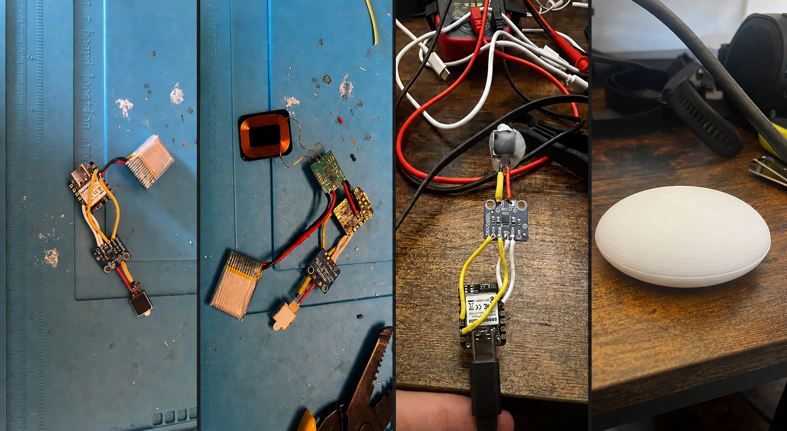

# PYBL

> **Status: Work in progress**

PYBL, is an experimental embedded-hardware project currently in the prototyping stage. It is intended to guide paced breathing through changing vibration intensity inside a small pebble-shaped device.

The current prototype combines a Seeed XIAO nRF52840, DRV2605L haptic driver, linear resonant actuator, touch input, LiPo battery and experimental wireless-power hardware. The project is not presented as a finished product: the electronics layout, firmware behaviour, power system and final form factor are still being tested and refined.

The collage above was assembled from original development photos. It shows four stages of the current prototype: a compact battery-powered assembly, integration of a wireless-power receiver, bench testing of the haptic driver and motor, and an early 3D-printed enclosure and form-factor study.

## Planned stand and interaction

The intended design includes a dedicated bedside stand that also acts as a wireless charging pad. PYBL should remain charged and ready while resting on the stand, without requiring a screen, app or menu.

Picking the pebble up from the stand is planned to start the meditation cycle automatically. It will then continue looping the paced-breathing vibration pattern until the pebble is returned to the stand or the session reaches its safety timeout. Returning it to the stand should end the active session and resume charging.

This interaction is aimed particularly at sleep and night-time use. A user should be able to reach for PYBL, begin a guided breathing exercise and put it back down without looking at a display or navigating an interface. The exact method used to detect whether the pebble is on the stand is still being evaluated as part of the hardware prototype.

## Work completed so far

- Connected and tested a compact microcontroller board
- Prototyped haptic-driver and vibration-motor control
- Explored battery-powered operation
- Began integrating wireless-power hardware
- Reworked wiring and component placement across several physical revisions
- Produced an early 3D-printed enclosure prototype

## Firmware

The current Arduino firmware is available at [`firmware/pybl_firmware.ino`](firmware/pybl_firmware.ino). It currently targets:

- A 6-second inhale, 1-second hold, 6-second exhale and 1-second pause
- Smooth real-time haptic intensity changes through the breathing cycle
- Touch-controlled session start and stop
- A 20-minute automatic session timeout
- Separate wake, sleep and low-battery vibration patterns
- Battery monitoring and low-power sleep behaviour

The firmware is an active prototype rather than a tagged release. In particular, the wake flow, battery measurements, charging behaviour and final pin configuration still need full end-to-end validation on the assembled hardware.

## Current priorities

- Make the electrical connections more robust and repeatable
- Continue firmware testing and haptic-response tuning
- Validate charging, power consumption and battery behaviour
- Prototype the charging stand and reliable dock-state detection
- Start and stop sessions automatically when the pebble is lifted or returned
- Reduce the prototype's overall size
- Design a safer, cleaner enclosure once the electronics stabilise

## Repository scope

For now, this repository contains the current firmware snapshot and a public development log for the physical prototype. Schematics and more detailed build notes will be added when they are stable and useful enough to share.

Because PYBL is still experimental, the photographs and notes should not be treated as finished assembly instructions or a production-ready design.
